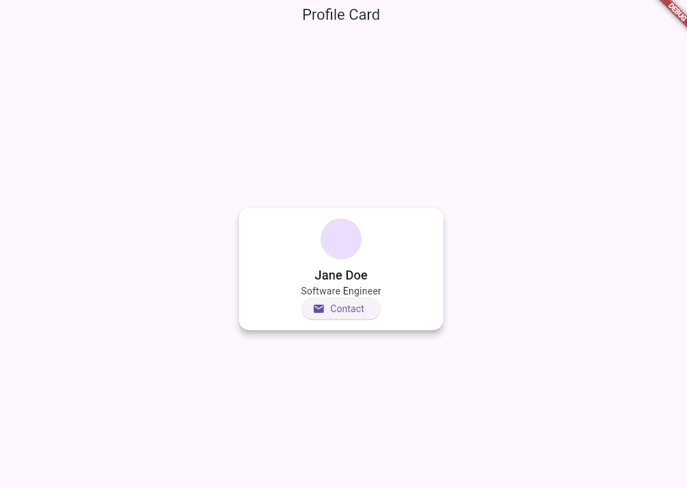

# Card Widget Demo

A simple profile card UI showcasing Flutter's `Card` widget in action.

##  How to Run
```bash
flutter pub get
flutter run
```

##  Widget: `Card`

This demo highlights three useful properties of the `Card` widget:

- `elevation`: Controls the shadow depth.
- `shape`: Defines the border shape (e.g., rounded corners).
- `color`: Changes the card's background color.

## 🖼️ Screenshot


